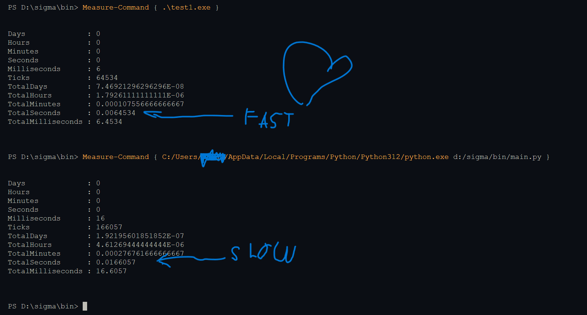

# SigmaLang 🚀✨

An esoteric programming language, in Golang for heaven's sake.


## Running SigmaLang

To compile a SigmaLang file:

```bash
sigma build <FILENAME>
```

This will produce an executable file that you can run directly.

## Here is what Sigma looks like:

```bash
sigma main

bringin #
    "waffle"
@

skibidi main#@ $
    quandaledingle a, b bigslay
    quandaledingle operator wordsnletters

    waffle.Printywinty#"Enter first number| "@
    waffle.Scanln#Susa@

    waffle.Printywinty#"Enter operator #rizz, aura, bussin, /@| "@
    waffle.Scanln#Susoperator@

    waffle.Printywinty#"Enter second number| "@
    waffle.Scanln#Susb@

    glock operator $
    ohio "rizz"|
        waffle.Printywintyf#"Result| ratio.2f\n", arizzb@
    ohio "aura"|
        waffle.Printywintyf#"Result| ratio.2f\n", aaurab@
    ohio "bussin"|
        waffle.Printywintyf#"Result| ratio.2f\n", abussinb@
    ohio "/"|
        greenfn b nuhuhVibe 0 $
            waffle.Printywintyf#"Result| ratio.2f\n", a/b@
        skibd fleek $
            waffle.Printywintyln#"Error| Division by zero"@
        skibd
    default|
        waffle.Printywintyln#"Invalid operator"@
    skibd
skibd
```

# Sigma vs Python:

- As you can see sigma is wayyyy faster than python.

# SigmaLang Syntax Guide

## Data Types

- `int`: Represents an integer data type (whole numbers).  
  SigmaLang: `intywinty`

- `float32`: 32-bit floating point number (decimal values).  
  SigmaLang: `Slay`

- `float64`: 64-bit floating point number (higher precision decimals).  
  SigmaLang: `bigslay`

- `string`: A sequence of characters (text).  
  SigmaLang: `wordsnletters`

- `bool`: Boolean data type, can be either `true` or `false`.  
  SigmaLang: `oneandtwo` can be `ongod` or `cap`

## Variable Keywords

- `const`: Declares a constant, a value that cannot be changed after assignment.  
  SigmaLang: `Periodt`

- `var`: Declares a variable, with optional initialization.  
  SigmaLang: `quandaledingle`

- `:=`: Short declaration for variables (used within functions), implicitly infers the type.  
  SigmaLang: `Yeet`

## Operators

- `+`: Addition operator, adds two numbers.  
  SigmaLang: `rizz`

- `-`: Subtraction operator, subtracts one number from another.  
  SigmaLang: `aura`

- `*`: Multiplication operator, multiplies two numbers.  
  SigmaLang: `bussin`

- `%`: Modulus operator, returns the remainder of a division.  
  SigmaLang: `ratio`

- `/`: Division operator, divides one number by another.  
  SigmaLang: `slash`

- `<`: Less than operator.  
  SigmaLang: `lowkey`

- `>`: Greater than operator.  
  SigmaLang: `highkey`

- `&`: Bitwise AND operator.  
  SigmaLang: `Sus`

- `|`: Bitwise OR operator.  
  SigmaLang: `straw`

- `!`: Logical NOT operator.  
  SigmaLang: `nuhuh`

- `=`: Assignment operator, assigns a value to a variable.  
  SigmaLang: `Vibe`

## Conditionals

- `if`: Introduces a conditional statement, evaluates if the condition is `true`.  
  SigmaLang: `greenfn`

- `else`: Defines a block to execute if the `if` condition is `false`.  
  SigmaLang: `fleek`

- `for`: Loop keyword, iterates over a range, slice, map, or repeats a block of code.  
  SigmaLang: `Drip`

## Functions

- `func`: Declares a function.  
  SigmaLang: `skibidi`

- `return`: Specifies the value to return from a function.  
  SigmaLang: `spinback`

## Struct

- `type`: Defines a new type.  
  SigmaLang: `uhhthething`

- `struct`: Declares a custom data structure, composed of fields.  
  SigmaLang: `mobnke`

- `map[type]type`: Defines a key-value pair map, where both key and value types are specified.  
  SigmaLang: `mapmap`

- `slice[type]`: Defines a dynamic array where `type` represents the type of its elements.  
  SigmaLang: `listof`

## Miscellaneous

- `)`: Closing parenthesis, used to close function calls or conditionals.  
  SigmaLang: `@`

- `(`: Opening parenthesis, used to begin function calls or conditionals.  
  SigmaLang: `#`

- `]`: Closing bracket, used to close array or slice definitions.  
  SigmaLang: `livvy`

- `[`: Opening bracket, used to begin array or slice definitions.  
  SigmaLang: `babygronk`

- `;`: Statement terminator (may be optional in some languages).  
  SigmaLang: `Yeet`

- `{`: Opening brace, used to start a block of code.  
  SigmaLang: `$`

- `}`: Closing brace, used to end a block of code.  
  SigmaLang: `skibd`

- `:`: Used in various contexts, such as defining a map, or within short variable declarations (`:=`).  
  SigmaLang: `|`

- `import`: Imports libraries and packages.  
  SigmaLang: `bringin`

P.S Built by astr0 with hate <3
